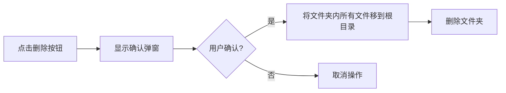
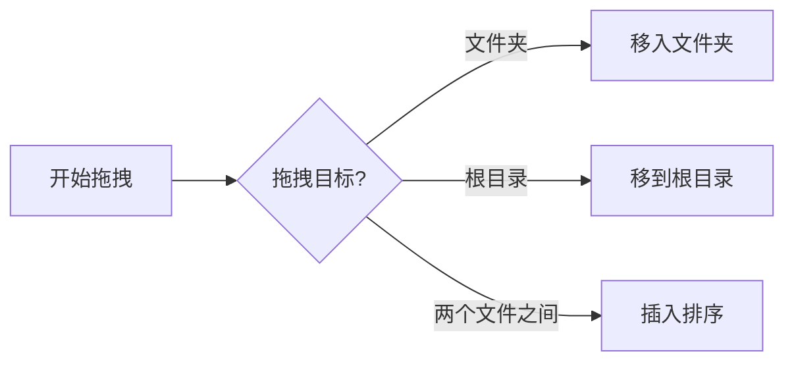

# MiniFlowy 文件夹功能产品需求文档 (PRD)

## 1. Product Overview
MiniFlowy是一款轻量级思维导图/大纲笔记应用。本次升级旨在为左侧侧边栏增加文件夹管理功能，支持无限嵌套的文件夹结构，提升文件组织效率。

- **主要目标**：通过文件夹功能更好地组织和管理大量文档
- **目标用户**：需要管理多个笔记文档的用户

## 2. Core Features

### 2.1 User Roles
| Role | Registration Method | Core Permissions |
|------|---------------------|------------------|
| Normal User | 用户名/密码注册 | 创建、编辑、删除文档和文件夹，拖拽管理文件 |

### 2.2 Feature Module
1. **侧边栏文件树**：支持无限嵌套文件夹，展开/收缩功能
2. **文件夹操作**：新建文件夹、删除文件夹、编辑文件夹图标
3. **文件操作**：新建文档（支持在文件夹内）、拖拽文件到文件夹、从文件夹拖出
4. **删除确认**：删除文件夹时的确认弹窗

### 2.3 Page Details
| Page Name | Module Name | Feature description |
|-----------|-------------|---------------------|
| 主页面 | 侧边栏文件树 | 显示文件夹和文档的树形结构，支持展开/收缩 |
| 主页面 | 新建操作 | 顶部+号支持新建文档和新建文件夹 |
| 主页面 | 拖拽功能 | 支持文档和文件夹的拖拽排序、移入/移出文件夹 |
| 主页面 | 删除功能 | 删除文件夹时显示确认弹窗，删除后文件移到根目录 |
| 主页面 | 图标编辑 | 文件夹支持切换预定义的emoji图标 |

## 3. Core Process

### 3.1 新建文件夹流程

### 3.2 删除文件夹流程

### 3.3 拖拽文件流程

## 4. User Interface Design

### 4.1 Design Style
- **主色调**：保持现有设计，蓝色为主色调
- **按钮风格**：圆角按钮，悬停效果
- **字体**：保持现有系统字体
- **布局风格**：树形结构，缩进表示嵌套层级
- **图标/emoji风格**：使用语义化emoji作为文件夹图标

### 4.2 预定义文件夹图标
提供以下emoji作为可选文件夹图标：
- 📁 默认文件夹
- 📂 打开的文件夹
- 📚 书籍/学习
- 📝 笔记
- 🎨 设计
- 💼 工作
- 🏠 个人
- 🗂️ 归档
- ⭐ 重要
- 📅 日程
- 🎯 目标
- 🔒 私密

### 4.3 Page Design Overview
| Page Name | Module Name | UI Elements |
|-----------|-------------|-------------|
| 主页面 | 侧边栏文件树 | 树形结构，缩进显示，展开/收缩箭头，文件夹emoji图标 |
| 主页面 | 新建下拉菜单 | 点击+号后显示"新建文档"和"新建文件夹"两个选项 |
| 主页面 | 删除确认弹窗 | 居中显示，包含警告图标、确认消息、取消/确认按钮 |
| 主页面 | 图标选择器 | 弹出面板，网格布局显示可选emoji图标 |

### 4.4 Responsiveness
- **桌面端**：完整功能，侧边栏可展开/收缩
- **移动端**：适配触屏操作，简化部分拖拽交互为菜单选择

## 5. 数据迁移
- 保留现有所有文档数据
- 现有文档默认在根目录
- 通过Alembic进行数据库迁移，确保Docker部署时无缝升级
