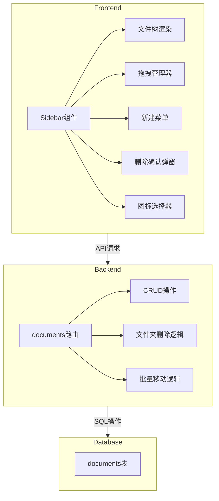
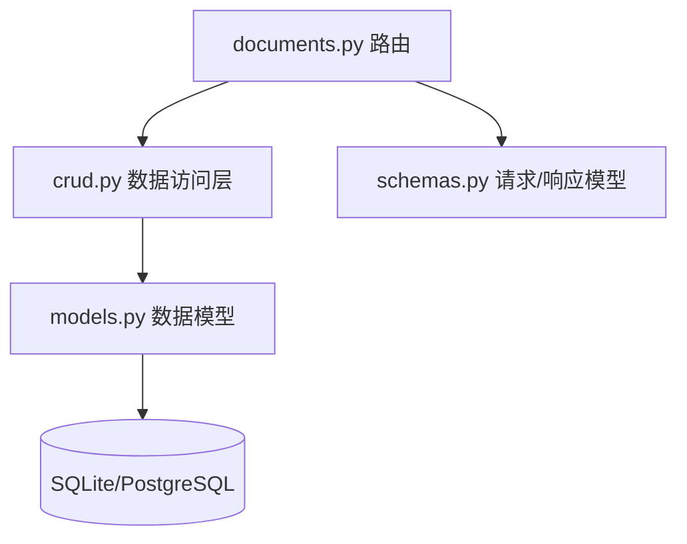
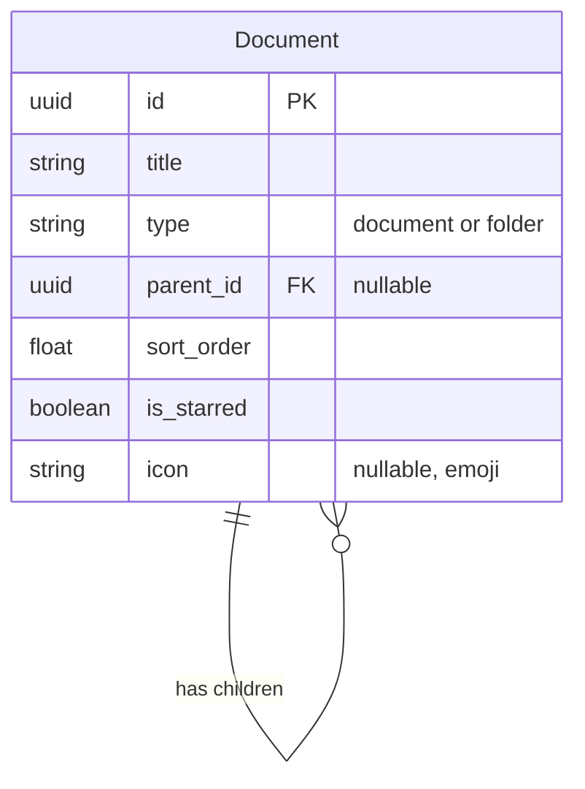

# MiniFlowy 文件夹功能技术架构文档

## 1. Architecture Design



## 2. Technology Description
- **Frontend**: React@19.2.0 + TypeScript + TailwindCSS + Vite
- **Backend**: FastAPI + SQLAlchemy
- **Database**: SQLite (本地开发) / PostgreSQL (Docker部署)
- **Migration**: Alembic
- **Drag and Drop**: react-dnd 或原生HTML5 Drag API

## 3. Route Definitions (Frontend)
保持现有路由不变，主要修改Sidebar组件。

## 4. API Definitions (Backend)

### 4.1 现有API增强
现有的documents API已经支持基本功能，需要增强以下部分：

#### 删除文件夹API (增强)
- **Endpoint**: `DELETE /documents/{id}`
- **功能**: 删除文件夹时，将其所有子项（文档和子文件夹）的parent_id设为null，然后删除文件夹
- **Request**: 
  ```typescript
  // 无额外参数
  ```
- **Response**: 
  ```typescript
  { success: boolean }
  ```

### 4.2 数据类型增强
在Document类型中添加icon字段：

```typescript
export interface Document {
  id: string;
  title: string;
  type: 'document' | 'folder';
  parent_id: string | null;
  sort_order: number;
  is_starred: boolean;
  icon?: string; // 新增：emoji图标
}
```

## 5. Server Architecture Diagram (Backend)



## 6. Data Model

### 6.1 数据模型定义



### 6.2 数据库迁移 (Alembic)

需要为documents表添加icon字段的迁移脚本：

```python
# alembic/versions/xxxx_add_icon_to_documents.py
from alembic import op
import sqlalchemy as sa

def upgrade():
    op.add_column('documents', sa.Column('icon', sa.String(), nullable=True))

def downgrade():
    op.drop_column('documents', 'icon')
```

### 6.3 模型修改 (models.py)

在Document模型中添加icon字段：

```python
class Document(Base):
    __tablename__ = "documents"
    # ... 现有字段 ...
    icon: Mapped[Optional[str]] = mapped_column(String, nullable=True)
```

### 6.4 Schema修改 (schemas.py)

在Document相关schemas中添加icon字段：

```python
class DocumentBase(BaseModel):
    title: str
    type: str = "document"
    parent_id: Optional[UUID] = None
    sort_order: float
    is_starred: bool = False
    icon: Optional[str] = None  # 新增

class DocumentUpdate(BaseModel):
    title: Optional[str] = None
    parent_id: Optional[UUID] = None
    sort_order: Optional[float] = None
    is_starred: Optional[bool] = None
    icon: Optional[str] = None  # 新增
```

## 7. 前端实现要点

### 7.1 Sidebar组件重构
- 递归渲染文件树
- 支持无限嵌套
- 展开/收缩状态管理
- 拖拽功能实现

### 7.2 拖拽功能
使用HTML5原生Drag API：
- `dragstart`: 开始拖拽，保存被拖拽项信息
- `dragover`: 拖拽经过，显示占位符
- `drop`: 放下，执行移动操作
- `dragend`: 拖拽结束，清理状态

### 7.3 状态管理
使用现有的DocumentContext，无需新增状态管理。

### 7.4 组件拆分
- `FileTree`: 递归文件树组件
- `FileTreeItem`: 单个文件/文件夹项
- `NewItemMenu`: 新建菜单
- `DeleteConfirmDialog`: 删除确认弹窗
- `IconPicker`: 图标选择器

## 8. 测试策略

### 8.1 后端测试
- 单元测试：CRUD操作
- 集成测试：文件夹删除逻辑（确保文件移到根目录）
- 迁移测试：Alembic迁移脚本测试

### 8.2 前端测试
- 组件测试：文件树渲染
- 交互测试：展开/收缩、新建、删除
- E2E测试：完整流程测试

## 9. 部署考虑

### 9.1 Docker部署
- Alembic迁移在容器启动时自动执行
- 确保数据完整性

### 9.2 数据迁移
- 现有数据不受影响
- icon字段默认为null
- 现有文档的parent_id保持不变
